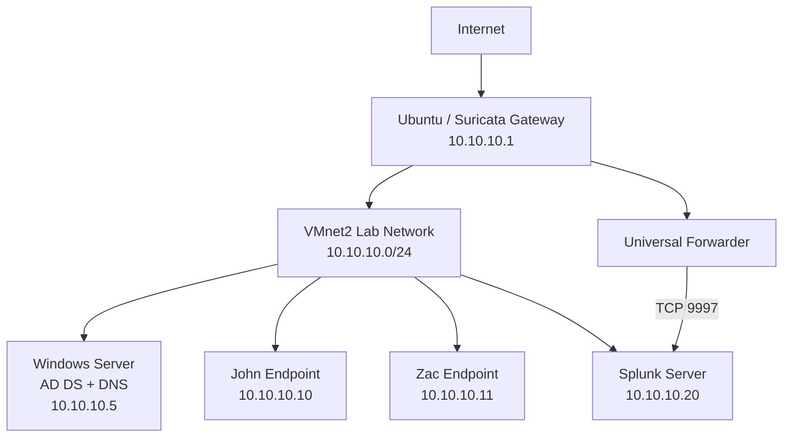

# SOC Analyst Home Lab

An end-to-end security operations lab designed and operated by **Zac Yu**. The environment simulates a small enterprise network and supports hands-on practice across identity, endpoint management, network detection, SIEM monitoring, threat investigation, and incident response.

> This repository contains sanitized lab documentation only. Credentials, tenant identifiers, customer data, API keys, and sensitive screenshots are excluded.

## Project objectives

- Build a segmented Windows enterprise lab with Active Directory and DNS.
- Route monitored endpoint traffic through a Suricata IDS gateway.
- Centralize Windows, Sysmon, and Suricata telemetry in Splunk.
- Create and validate detections with controlled attack simulations.
- Practise SOC triage, investigation, escalation, containment, and reporting.
- Document troubleshooting decisions and evidence in a professional portfolio format.

## Current architecture



The Admin Device address must be unique. If it was previously configured as `10.10.10.20`, it should be changed (for example, to `10.10.10.21`) because the Splunk server currently uses `10.10.10.20`.

## Progress overview

| Workstream | What has been completed | Status |
|---|---|---|
| Active Directory | Windows Server domain controller, DNS, domain users, domain-joined endpoints, IP migration to isolated subnet | Completed and validated |
| Entra ID / Intune | Entra Connect, Hybrid Join, automatic MDM enrollment, policies, app deployment, compliance testing | Completed lab phase |
| Windows telemetry | Security logs, Sysmon, Splunk Universal Forwarder, event-based searches | Completed lab phase |
| Splunk SIEM | Log ingestion, SPL searches, dashboards, alert use cases and investigation workflow | In progress |
| Suricata IDS | Gateway deployment, Emerging Threats rules, AF_PACKET capture and custom ICMP signature | Detection validated |
| Suricata to Splunk | Forwarder target updated to Splunk server at `10.10.10.20:9997` | Connectivity validation in progress |
| Endpoint detection | Microsoft Defender for Endpoint and Sophos investigation practice | Completed lab exercises |
| Attack simulation | Atomic Red Team discovery tests and planned safe PowerShell attack chain | In progress |
| Microsoft 365 security | Exchange Online administration, Conditional Access, Purview DLP and investigation exercises | Completed lab exercises |
| Vulnerability management | Nessus/alternative scanner planning and remediation workflow | Planned |

See [PROJECT_STATUS.md](PROJECT_STATUS.md) for detailed progress and next actions.

## Featured projects

### Suricata IDS gateway

Deployed Suricata 7 on an Ubuntu gateway, corrected packet-capture interface configuration, downloaded Emerging Threats rules, separated local detections from managed rules, and validated a custom ICMP signature against traffic from a Windows endpoint.

Evidence: [docs/suricata-ids-gateway.md](docs/suricata-ids-gateway.md)

### Active Directory and endpoint management

Built an on-premises Windows domain, configured DNS and domain endpoints, integrated identities and devices with Entra ID, enabled automatic Intune enrollment through Group Policy, and tested compliance remediation.

Evidence: [docs/active-directory-intune.md](docs/active-directory-intune.md)

### Splunk detection engineering

Forwarded Windows and Sysmon telemetry to Splunk, investigated authentication and process events, and developed searches for failed logons, PowerShell activity, DNS anomalies, and overseas Microsoft 365 sign-ins.

Evidence: [docs/splunk-detection-engineering.md](docs/splunk-detection-engineering.md)

### SOC investigation exercises

Practised alert triage and evidence correlation across IDS/IPS, NetFlow, endpoint telemetry, identity logs, and email security. Produced investigation notes, impact assessments, containment recommendations, and escalation summaries.

Evidence: [docs/investigation-playbooks.md](docs/investigation-playbooks.md)

## Repository map

```text
soc-analyst-home-lab/
├── README.md
├── PROJECT_STATUS.md
├── SECURITY.md
├── docs/
│   ├── active-directory-intune.md
│   ├── github-upload-guide.md
│   ├── investigation-playbooks.md
│   ├── network-architecture.md
│   ├── splunk-detection-engineering.md
│   └── suricata-ids-gateway.md
├── detections/
│   └── suricata/local.rules
└── screenshots/
    └── README.md
```

## Skills demonstrated

Splunk, SPL, Sysmon, Windows Event Logs, Active Directory, DNS, Entra ID, Intune, Microsoft Defender for Endpoint, Sophos Endpoint, Suricata, Cisco Meraki concepts, KQL, PowerShell, Linux administration, MITRE ATT&CK mapping, alert triage, detection engineering, incident response, and technical documentation.

## About me

I am an Australian permanent resident based in Sydney, building my career in security operations. My background combines SOC monitoring, endpoint and identity administration, SIEM dashboard development, and hands-on investigation experience.

