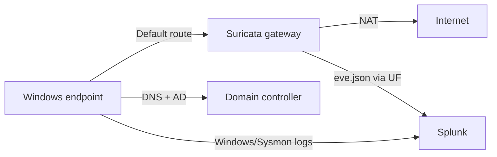

# Network Architecture

## Address plan

| Asset | Role | Address | Notes |
|---|---|---:|---|
| Ubuntu / Suricata | Gateway and IDS | `10.10.10.1` | Internal interface on VMnet2 |
| Windows Server | AD DS and DNS | `10.10.10.5` | Clients use this address for DNS |
| John endpoint | Domain user workstation | `10.10.10.10` | Test traffic source |
| Zac endpoint | Domain user workstation | `10.10.10.11` | AD authentication testing |
| Splunk server | SIEM | `10.10.10.20` | Web `8000`, receiver `9997` |
| Admin Device | Administrative workstation | `10.10.10.21` recommended | Must not duplicate Splunk IP |

## Traffic flow

Because Suricata is also the default gateway, internal devices cannot access the internet when the gateway VM is powered off. Devices on the same VMnet2 subnet can still communicate locally.

## DNS design

Domain-joined endpoints use `10.10.10.5` as their preferred DNS server. The domain controller resolves the internal AD domain and should use DNS forwarders for internet names. Pointing domain clients directly to public DNS could break domain discovery and authentication.

## Known dependency

The gateway is a single point of failure in the current design. This is acceptable for a learning environment and helps demonstrate inline visibility, but it would require redundancy in production.

