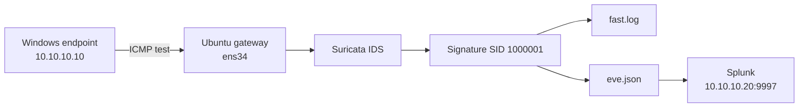

# Suricata IDS Gateway Build

Date: 22 July 2026  
Status: Custom network detection validated; Splunk ingestion in progress

## Outcome

Deployed Suricata 7.0.3 on an Ubuntu gateway, loaded approximately 52,000 Emerging Threats rules, corrected the packet-capture interface, and validated an analyst-readable alert from controlled Windows endpoint traffic.

```text
[1:1000001:1] LAB ICMP Ping Detected
{ICMP} 10.10.10.10:8 -> 8.8.8.8:0
```



## Key configuration

Suricata runs in passive IDS mode with AF_PACKET on the lab-facing interface:

```text
RUN=yes
SURCONF=/etc/suricata/suricata.yaml
LISTENMODE=af-packet
IFACE=ens34
```

```yaml
af-packet:
  - interface: ens34
```

Managed and local rules are separated so an update does not overwrite custom detections:

```yaml
rule-files:
  - suricata.rules
  - local.rules
```

The validation rule is stored in [`../detections/suricata/local.rules`](../detections/suricata/local.rules).

## Validation procedure

```bash
sudo suricata-update
sudo suricata -T -c /etc/suricata/suricata.yaml
sudo service suricata restart
sudo tail -n 20 /var/log/suricata/fast.log
```

Controlled traffic was generated from the Windows endpoint:

```cmd
ping 8.8.8.8
```

## Troubleshooting record

| Symptom | Root cause | Resolution |
|---|---|---|
| Rules could not be loaded | Managed rule file had not been generated | Ran `suricata-update` |
| Native systemd unit not found | Package used a SysV init script | Used `service suricata` management commands |
| Engine ran but captured no traffic | Configuration referenced nonexistent `eth0` | Changed capture interface to `ens34` |
| MTU lookup failed | Interface mismatch remained in `suricata.yaml` | Corrected every interface reference and retested configuration |
| Custom rule risked being overwritten | It was initially placed in the managed rule file | Moved SID `1000001` into `local.rules` |
| Universal Forwarder inactive | Destination still used the former Splunk IP | Updated destination to `10.10.10.20:9997` |

## Next steps

- Confirm Splunk receiving port TCP `9997` is enabled.
- Verify the forwarder reports `10.10.10.20:9997` under Active forwards.
- Validate JSON alert output in `eve.json`.
- Create the `suricata` index/sourcetype in Splunk.
- Build panels for timeline, severity, category, signature, source and destination.

