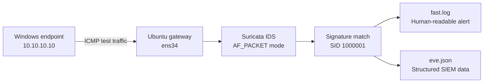
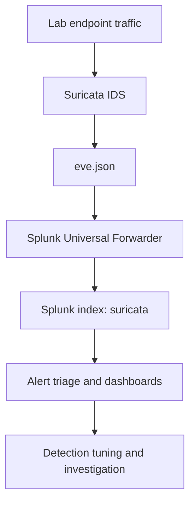

# SOC Home Lab Build Log — Suricata IDS Gateway

**Date:** 22 July 2026  
**Author:** Zac Yu  
**Project:** SOC Analyst Home Lab  
**Status:** IDS traffic detection validated; local rule migration in progress

## Today's outcome

Today I built and validated the network IDS layer of my SOC home lab. An Ubuntu gateway now runs Suricata in IDS mode, monitors traffic from a Windows test endpoint, loads Emerging Threats rules, and generates a readable signature alert when test traffic matches a custom rule.

The successful test produced this alert:

```text
[1:1000001:1] LAB ICMP Ping Detected
{ICMP} 10.10.10.10:8 -> 8.8.8.8:0
```

This confirms the complete detection path:



## Lab architecture

| Component | Role | Current configuration |
|---|---|---|
| Windows test endpoint | Generates normal and simulated suspicious traffic | `10.10.10.10/24` |
| Ubuntu gateway | Routes lab traffic and hosts the IDS | Internal interface: `ens34` |
| Suricata 7.0.3 | Network intrusion detection | IDS mode using `AF_PACKET` |
| Emerging Threats rules | Production-style signature coverage | Approximately 52,000 rules loaded |
| `fast.log` | Analyst-friendly alerts | Validation alert confirmed |
| `eve.json` | Structured JSON telemetry | Planned for Splunk ingestion |

> The lab is intentionally running Suricata as an IDS first. Traffic is detected and logged but not blocked. IPS mode can be introduced later after the detection pipeline is stable.

## Build progress

### 1. Installed Suricata and downloaded rules

I installed Suricata on the Ubuntu gateway and used `suricata-update` to download the rule set:

```bash
sudo suricata-update
```

The generated rule file was confirmed at:

```text
/var/lib/suricata/rules/suricata.rules
```

### 2. Corrected the service configuration

The initial service configuration was not suitable for this lab. I configured Suricata to start in passive IDS mode:

```text
RUN=yes
SURCONF=/etc/suricata/suricata.yaml
LISTENMODE=af-packet
IFACE=ens34
```

Why these values matter:

| Setting | Purpose |
|---|---|
| `RUN=yes` | Allows the startup script to launch Suricata |
| `LISTENMODE=af-packet` | Passively inspects packets without blocking them |
| `IFACE=ens34` | Selects the lab-facing network interface |

### 3. Corrected the capture interface in `suricata.yaml`

Suricata initially started but attempted to inspect a nonexistent interface:

```text
Failure when trying to get MTU via ioctl for 'eth0': No such device
```

The startup defaults had been updated, but the `af-packet` section in `/etc/suricata/suricata.yaml` still referenced `eth0`. I changed it to:

```yaml
af-packet:
  - interface: ens34
```

I then validated the configuration before restarting:

```bash
sudo suricata -T -c /etc/suricata/suricata.yaml
sudo service suricata restart
```

The validation completed successfully and the engine initialized its logging outputs.

### 4. Created and tested a custom signature

To prove that Suricata could see traffic from the Windows subnet, I created a controlled ICMP detection rule:

```suricata
alert icmp 10.10.10.0/24 any -> any any (msg:"LAB ICMP Ping Detected"; sid:1000001; rev:1;)
```

From the Windows endpoint, I generated test traffic:

```cmd
ping 8.8.8.8
```

The alert was then confirmed in:

```bash
sudo tail -n 20 /var/log/suricata/fast.log
```

Result:

```text
[1:1000001:1] LAB ICMP Ping Detected
{ICMP} 10.10.10.10:8 -> 8.8.8.8:0
```

### 5. Began separating local and managed rules

The first test rule was temporarily appended to `suricata.rules`. Because that file is regenerated by `suricata-update`, keeping custom detections there would risk losing them during an update.

I migrated SID `1000001` to:

```text
/var/lib/suricata/rules/local.rules
```

I verified that only one copy of the SID remains:

```bash
sudo grep -Rni "sid:1000001" /var/lib/suricata/rules/
```

Current result: the rule exists only in `local.rules`, eliminating the duplicate-signature risk.

The remaining migration step is to load the file in `suricata.yaml`:

```yaml
rule-files:
  - suricata.rules
  - local.rules
```

After that change, I will run a configuration test, restart Suricata, and repeat the ICMP validation.

## Troubleshooting record

| Symptom | Root cause | Resolution | Lesson learned |
|---|---|---|---|
| Suricata could not load rules | `suricata.rules` did not yet exist | Ran `sudo suricata-update` | Validate rule sources before diagnosing the engine |
| `suricata.service` was not found | Installation used a SysV init script instead of a native systemd unit | Managed it with `sudo service suricata ...` | Confirm how the package registers its service |
| Service appeared active but captured no traffic | Suricata still referenced `eth0` | Updated the interface to `ens34` | “Running” does not prove that packet capture is working |
| MTU lookup failed for `eth0` | The VM did not have an interface named `eth0` | Corrected both startup defaults and `suricata.yaml` | Check every configuration layer that can define an interface |
| Custom rule could be overwritten | Rule was stored in the managed rules file | Migrated it to `local.rules` | Separate vendor-managed and locally managed detections |

## Validation checklist

- [x] Suricata installed on the Ubuntu gateway
- [x] Emerging Threats rules downloaded
- [x] Configuration syntax test passed
- [x] Suricata engine started successfully
- [x] Correct interface `ens34` selected
- [x] IDS mode enabled with AF_PACKET
- [x] Windows endpoint traffic observed
- [x] Custom SID `1000001` triggered
- [x] Alert written to `fast.log`
- [x] Custom rule moved to `local.rules`
- [ ] Add `local.rules` to `suricata.yaml`
- [ ] Revalidate and restart after migration
- [ ] Confirm alert in `eve.json`
- [ ] Forward `eve.json` to Splunk
- [ ] Build a Suricata IDS dashboard in Splunk

## Detection pipeline planned for the next session



Planned Splunk views:

- Alert timeline
- Top signatures
- Source and destination IPs
- Severity and category distribution
- Allowed versus blocked actions
- Custom lab detections by signature ID

## Skills demonstrated

- Network IDS deployment and configuration
- Linux service and log troubleshooting
- Packet-capture interface selection
- Suricata rule management
- Custom signature development
- Controlled validation of a detection rule
- Root-cause analysis across service, engine, interface, and rule layers
- Preparation of JSON security telemetry for SIEM ingestion

## Evidence to add to the repository

For a clean public portfolio, screenshots should be cropped and sanitized before upload. Recommended evidence:

1. Network adapter configuration showing `ens34`
2. Successful `suricata -T` output
3. Suricata engine startup log
4. Windows `ping 8.8.8.8` test
5. `fast.log` showing SID `1000001`
6. `grep` output showing the rule only in `local.rules`
7. Future Splunk search and dashboard screenshots

Avoid publishing usernames, passwords, public IP addresses, tenant names, API keys, or unrelated system information.

## Repository structure

```text
soc-home-lab/
├── README.md
├── architecture/
│   └── network-design.md
├── build-logs/
│   └── 2026-07-22-suricata-ids-gateway.md
├── detections/
│   └── suricata/
│       └── local.rules
├── screenshots/
│   └── suricata/
├── splunk/
│   ├── searches/
│   └── dashboards/
└── incident-reports/
```

## Key takeaway

The most important result was not simply getting the Suricata process to run. I verified that endpoint traffic crossed the correct interface, matched a known signature, and produced analyst-readable evidence. This turns the IDS deployment from an installation exercise into a tested security-monitoring capability.

