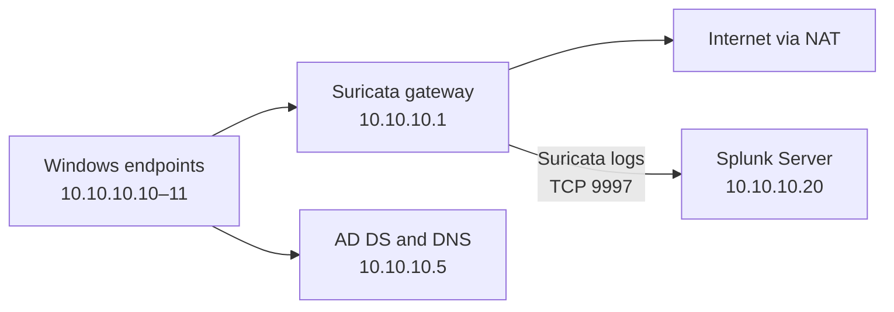
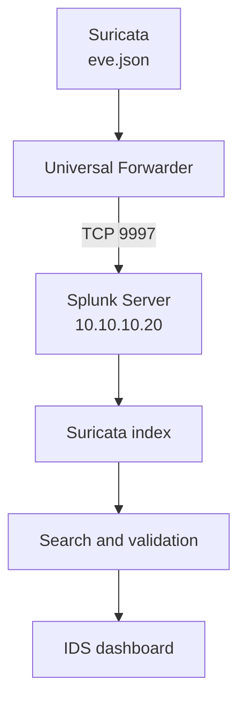

# SOC Home Lab Build Log — Network Migration, AD/DNS Validation and Splunk Forwarder Recovery

**Date:** 23 July 2026  
**Author:** Zac Yu  
**Project:** SOC Analyst Home Lab  
**Status:** Internal network migration completed; AD/DNS validated; Splunk forwarding target corrected and final connection validation pending

## Today's outcome

Today I migrated the core SOC home lab systems to the dedicated `10.10.10.0/24` security lab network. I updated the Domain Controller, Windows endpoints, Ubuntu Suricata gateway and Splunk Server addressing, removed a stale DNS record, validated Active Directory name resolution, and corrected the Splunk Universal Forwarder destination after the Splunk Server IP changed.

The principal verified results were:

- `CyberLanding.com` now resolves only to the Domain Controller at `10.10.10.5`.
- The Windows endpoints can reach the Domain Controller across VMnet2.
- Domain authentication testing is ready using `CYBERLANDING\Zac`.
- The Ubuntu gateway can reach the Splunk Server at `10.10.10.20`.
- The Universal Forwarder target was corrected from the old address to `10.10.10.20:9997`.



## Updated lab IP plan

| Component | Role | Address | DNS / gateway |
|---|---|---:|---|
| Ubuntu / Suricata | Internal gateway and network IDS | `10.10.10.1` | Upstream connection through its external adapter |
| Windows Server | AD DS and internal DNS | `10.10.10.5` | DNS: local AD DNS |
| John endpoint | Domain-joined test endpoint | `10.10.10.10` | Gateway: `10.10.10.1`; DNS: `10.10.10.5` |
| Zac endpoint | Domain-user test endpoint | `10.10.10.11` | Gateway: `10.10.10.1`; DNS: `10.10.10.5` |
| Splunk Server | Central SIEM and forwarder receiver | `10.10.10.20` | Gateway: `10.10.10.1` |
| Admin Device | Administrative workstation | `10.10.10.21` proposed | Must not duplicate the Splunk IP |

> All systems on VMnet2 use the Ubuntu system at `10.10.10.1` as their default gateway. If the Ubuntu gateway VM is powered off, the internal systems can still communicate within the subnet, but they cannot reach the Internet.

## Build progress

### 1. Migrated the Domain Controller to the lab subnet

The Domain Controller and DNS server were moved from the previous network address to:

```text
IP address: 10.10.10.5
Subnet mask: 255.255.255.0
Default gateway: 10.10.10.1
```

This placed the AD infrastructure on the same dedicated subnet as the endpoints, Suricata gateway and Splunk Server.

### 2. Cleaned up the AD-integrated DNS records

After the IP migration, DNS still briefly returned the former Domain Controller address `192.168.0.224`. I reviewed the `CyberLanding.com` forward lookup zone in DNS Manager and retained the valid records pointing to `10.10.10.5`.

The final lookup returned:

```text
Name:    CyberLanding.com
Address: 10.10.10.5
```

This confirmed that the stale IPv4 response was no longer being returned.

The lookup also displayed `Server: Unknown` with the loopback address `::1`. This does not prevent AD or forward name resolution from working; it indicates that the DNS server does not yet have a matching reverse lookup record for its own address. A reverse lookup zone can be added later as a cleanup task.

### 3. Validated Active Directory connectivity

I confirmed that the endpoint could reach the Domain Controller:

```cmd
ping 10.10.10.5
nslookup CyberLanding.com
```

The expected AD acceptance test is a domain sign-in from the Zac endpoint:

```text
CYBERLANDING\Zac
```

Successful sign-in proves that the endpoint can locate the Domain Controller through DNS, reach the authentication services and maintain its domain trust relationship.

### 4. Reconfigured the Zac endpoint

The Zac endpoint was moved from its former bridged configuration to the VMnet2 internal network and assigned:

```text
IP address:       10.10.10.11
Subnet mask:      255.255.255.0
Default gateway:  10.10.10.1
Preferred DNS:    10.10.10.5
```

Using the Domain Controller as the preferred DNS server is important. Configuring a public resolver such as `8.8.8.8` directly on a domain endpoint could prevent it from locating AD-specific DNS and service records.

### 5. Confirmed the gateway dependency

Once the endpoint was moved to VMnet2, Internet access depended on the Ubuntu gateway. The intended traffic path is:

```text
Zac endpoint → Ubuntu gateway / Suricata → NAT interface → Internet
```

This explains why the endpoint loses Internet access when the gateway VM is stopped. The design creates a useful inline monitoring point for the lab, while also introducing a deliberate single point of failure.

### 6. Corrected the Splunk Universal Forwarder destination

The Ubuntu Universal Forwarder was still configured to send data to the former Splunk address:

```text
192.168.0.247:9997
```

The old destination appeared as a configured but inactive forward. I removed it and initially tested the planned address `10.10.10.30`, but an `ipconfig` check on the Splunk Server confirmed that its real address is:

```text
10.10.10.20
```

I therefore corrected the forwarding destination to:

```text
10.10.10.20:9997
```

The Ubuntu gateway can now successfully ping `10.10.10.20`, proving Layer 3 connectivity between the log source and SIEM server.

The final Forwarder acceptance check is:

```bash
sudo /opt/splunkforwarder/bin/splunk list forward-server
```

Expected result:

```text
Active forwards:
    10.10.10.20:9997
```

If the destination remains inactive despite successful ping, I will verify that Splunk is listening on TCP `9997` and that the Windows Firewall permits the connection.

## Troubleshooting record

| Symptom | Root cause | Resolution | Lesson learned |
|---|---|---|---|
| DNS returned both the old and new DC addresses | Stale data remained after the Domain Controller IP migration | Reviewed DNS records and cleared/revalidated the lookup | Always validate DNS after changing a Domain Controller address |
| `Server: Unknown` appeared in `nslookup` | No reverse DNS record exists for the DNS server address | Forward lookup was validated; reverse zone deferred | Reverse lookup improves identification but is not required for basic AD operation |
| Zac endpoint could no longer access the Internet | It was moved from bridged networking to VMnet2 and now relies on the Ubuntu gateway | Retained gateway `10.10.10.1`; confirmed the architectural dependency | Internal routing and Internet access must be validated separately from AD connectivity |
| Universal Forwarder showed the old target as inactive | The Splunk Server IP changed during the network migration | Removed `192.168.0.247:9997` and added the new destination | Recheck all IP-dependent integrations after subnet changes |
| `10.10.10.30:9997` remained inactive | The planned address did not match the Splunk Server's actual IP | Verified with `ipconfig` and corrected the target to `10.10.10.20:9997` | Verify the live system address before updating dependent services |
| Possible duplicate use of `10.10.10.20` | Splunk and the planned Admin Device address overlapped | Reserved `.20` for Splunk and proposed `.21` for Admin Device | Maintain a single authoritative IP allocation table |

## Validation checklist

- [x] Domain Controller moved to `10.10.10.5`
- [x] `CyberLanding.com` resolves to `10.10.10.5`
- [x] Old Domain Controller IPv4 address no longer appears in the final lookup
- [x] Zac endpoint configured as `10.10.10.11/24`
- [x] Zac endpoint DNS configured as `10.10.10.5`
- [x] VMnet2 gateway dependency documented
- [x] Splunk Server address verified as `10.10.10.20`
- [x] Ubuntu-to-Splunk ICMP connectivity confirmed
- [x] Universal Forwarder destination corrected to `10.10.10.20:9997`
- [ ] Confirm `10.10.10.20:9997` appears under `Active forwards`
- [ ] Confirm Splunk is listening on TCP `9997`
- [ ] Search Splunk for newly received Ubuntu/Suricata events
- [ ] Validate domain login using `CYBERLANDING\Zac`
- [ ] Create the reverse lookup zone if clean DNS server identification is desired
- [ ] Confirm Admin Device uses a unique IP such as `10.10.10.21`

## Next session plan

1. Confirm the Universal Forwarder reports `10.10.10.20:9997` as active.
2. Verify the receiving port in Splunk under **Settings → Forwarding and receiving**.
3. Confirm `eve.json` is included in the Universal Forwarder inputs.
4. Search Splunk for Suricata events and validate host, source and sourcetype fields.
5. Create the dedicated `suricata` index if it is not already present.
6. Build the first dashboard panels for alert count, top signatures, source IP and destination IP.



## Skills demonstrated

- Network re-addressing and subnet planning
- Active Directory and DNS migration validation
- Windows endpoint static IP and DNS configuration
- Gateway, NAT and routing dependency analysis
- Splunk Universal Forwarder administration
- TCP forwarding path troubleshooting
- Evidence-based acceptance testing
- Maintaining accurate infrastructure documentation

## Evidence to add to GitHub

Recommended sanitized screenshots:

1. DNS Manager showing the `10.10.10.5` records
2. Successful `nslookup CyberLanding.com`
3. Zac endpoint IPv4 configuration
4. Splunk Server `ipconfig` showing `10.10.10.20`
5. Ubuntu `ping 10.10.10.20` result
6. Universal Forwarder output showing `10.10.10.20:9997` as active
7. Splunk search showing newly received Suricata events

Do not include passwords, API keys, public IP addresses, user-sensitive information or unrelated system details in public screenshots.

## Suggested repository location

```text
projects/
└── suricata-ids-gateway/
    ├── 2026-07-22-build-log.md
    └── 2026-07-23-network-migration-ad-dns-splunk-forwarder.md
```

## Key takeaway

Today's work was not only an IP-address change. I traced every dependency affected by the subnet migration: AD-integrated DNS, endpoint name resolution, domain connectivity, gateway routing and the Splunk forwarding destination. By verifying each layer separately, I restored a consistent network design and prepared the Suricata-to-Splunk pipeline for final ingestion testing.
