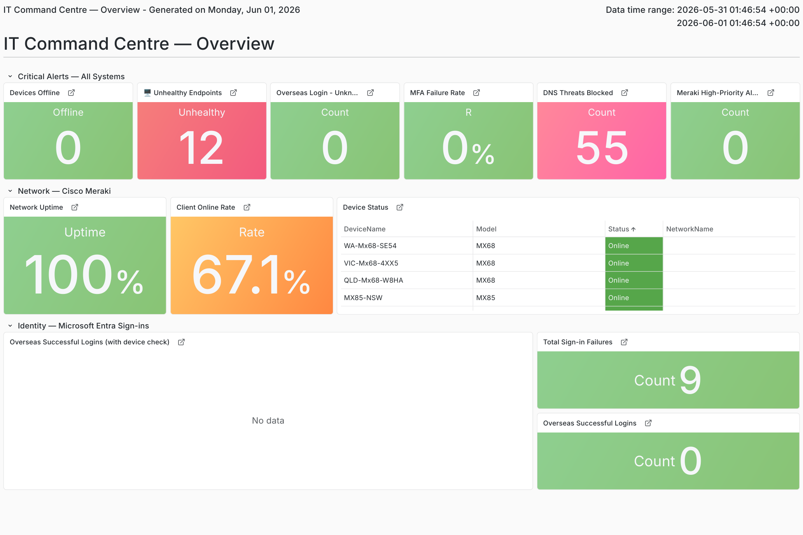
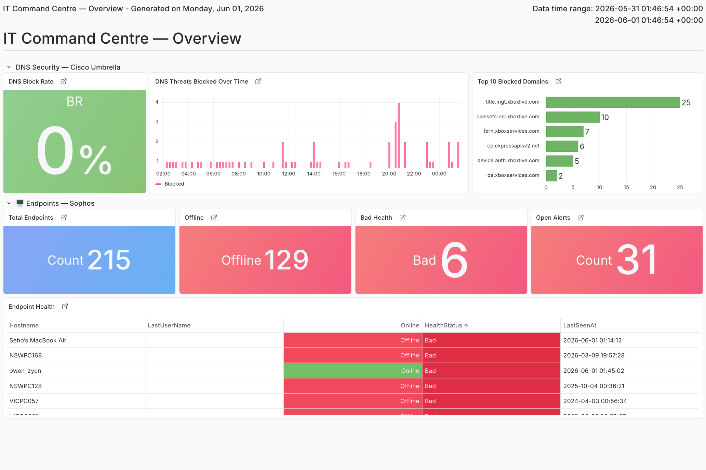
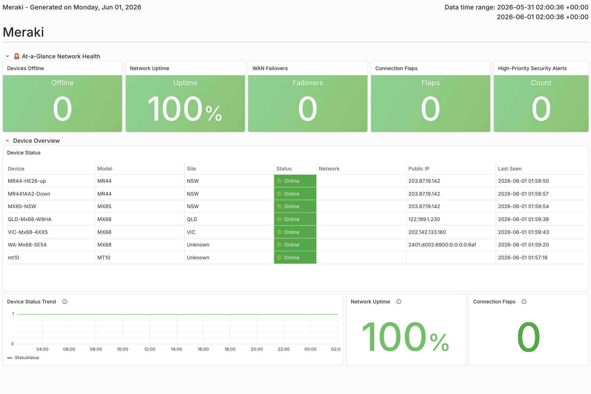
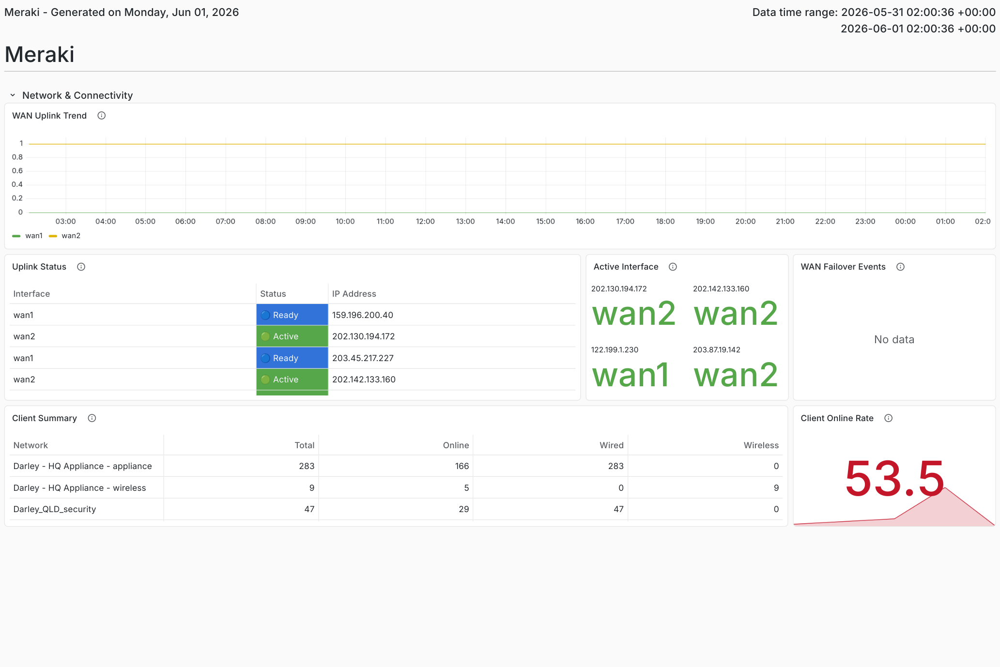
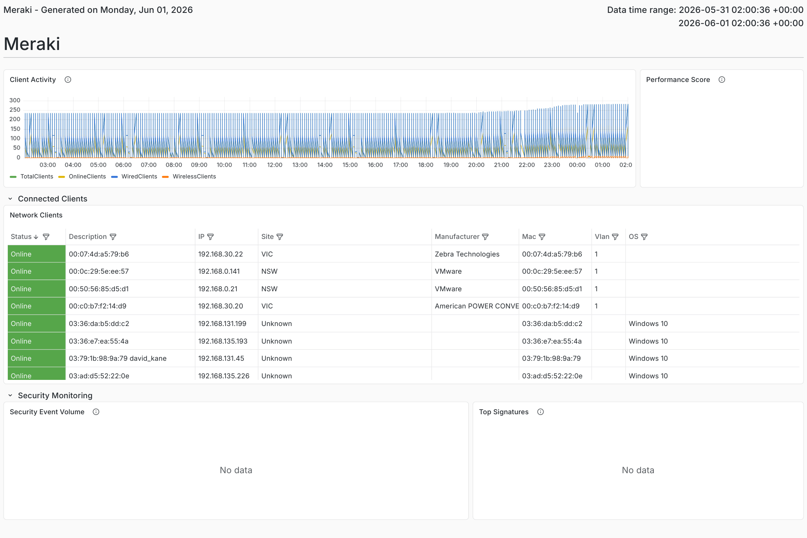
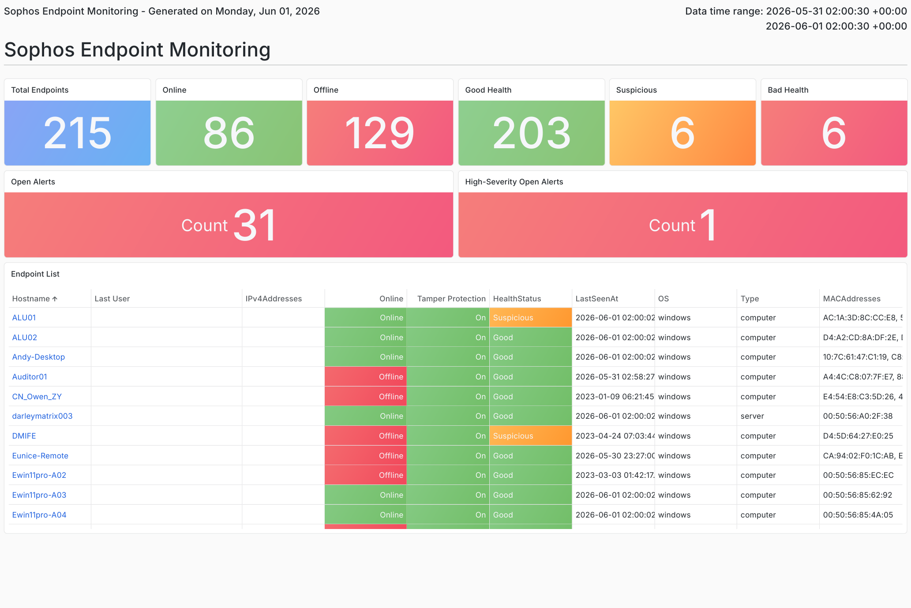
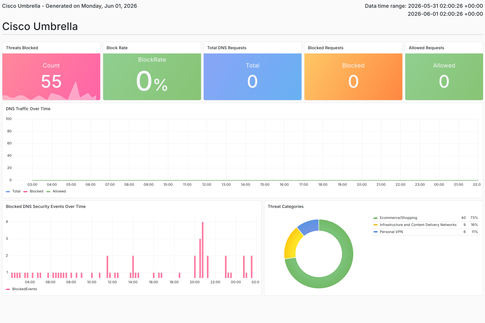

# Enterprise SOC Monitoring Dashboard Migration

> Migrated enterprise security monitoring dashboards from Splunk to Grafana using Azure Data Explorer (ADX) and Kusto Query Language (KQL).

This project focused on developing operational dashboards that consolidated security data from multiple enterprise platforms into a centralised SOC monitoring solution.

---

# Business Context

The customer planned to modernise its monitoring platform by migrating operational dashboards from Splunk to Grafana.

My role was to design and develop Grafana dashboards using Azure Data Explorer (ADX) and Kusto Query Language (KQL), enabling SOC analysts to monitor multiple enterprise security platforms through a single interface.

---

# Technical Architecture

Cisco Meraki
        │
Sophos Central
        │
Cisco Umbrella
        │
Microsoft Entra ID
        │
Azure Data Explorer (ADX)
        │
Grafana
        │
SOC Analysts

---

# Dashboard Gallery

## 1. Enterprise SOC Overview

Provides a single-pane-of-glass operational overview combining network, endpoint, DNS and identity monitoring.

---

## 2. Endpoint Security Overview

Combines Sophos endpoint health with Cisco Umbrella DNS security metrics to improve operational visibility.

---

## 3. Cisco Meraki — Network Health

Displays enterprise network health including device availability, uptime, client connectivity and infrastructure status.

---

## 4. Cisco Meraki — WAN Connectivity

Visualises WAN connectivity, uplink status and network resilience across enterprise locations.

---

## 5. Cisco Meraki — Client Activity

Provides visibility into connected clients, network usage and operational activity.

---

## 6. Sophos Endpoint Monitoring

Displays endpoint inventory, device health, security alerts and endpoint protection status.

---

## 7. Cisco Umbrella DNS Security

Provides DNS threat monitoring including blocked requests, threat categories and DNS activity.

---

# My Responsibilities

- Developed production Grafana dashboards using Kusto Query Language (KQL)
- Queried operational data from Azure Data Explorer (ADX)
- Designed dashboard layouts based on SOC operational requirements
- Built reusable visualisation components
- Validated dashboard accuracy using production monitoring data
- Worked with stakeholders to improve dashboard usability

---

# Technical Stack

| Area | Technology |
|------|------------|
| Dashboard Platform | Grafana |
| Data Platform | Azure Data Explorer (ADX) |
| Query Language | Kusto Query Language (KQL) |
| Network Monitoring | Cisco Meraki |
| Endpoint Security | Sophos Central |
| DNS Security | Cisco Umbrella |
| Identity Monitoring | Microsoft Entra ID |

---

# Technical Challenges

During development several technical challenges were encountered, including:

- Optimising KQL queries for large datasets
- Adapting dashboards to different data schemas
- Improving dashboard performance
- Designing dashboards for SOC operational workflows
- Validating dashboard accuracy against production data
- Refining dashboard layouts based on stakeholder feedback

These challenges required continuous testing, query optimisation and dashboard refinement.

---

# Business Impact

The completed dashboards provided SOC analysts with a centralised monitoring interface covering:

- Enterprise infrastructure monitoring
- Network visibility
- Endpoint monitoring
- DNS security monitoring
- Identity monitoring

The project improved operational visibility by consolidating multiple security platforms into a unified dashboard experience.

---

# Skills Demonstrated

- Grafana Dashboard Development
- Azure Data Explorer (ADX)
- Kusto Query Language (KQL)
- Security Monitoring
- SOC Operations
- Dashboard Design
- Infrastructure Monitoring
- Network Monitoring
- Endpoint Security Monitoring
- DNS Security Monitoring
- Stakeholder Communication

---

# Lessons Learned

This project reinforced the importance of designing dashboards around operational workflows rather than simply visualising data.

Close collaboration with stakeholders and iterative dashboard improvements were essential to delivering dashboards that were both technically accurate and operationally valuable.
